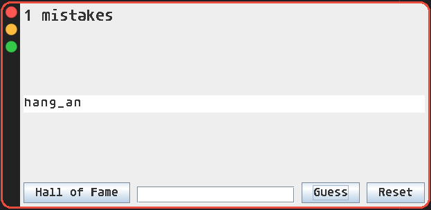
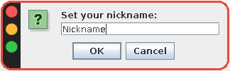
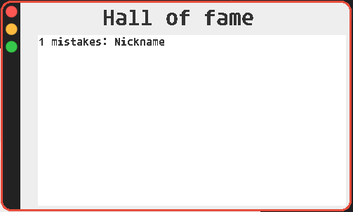

<h1 align="center" id="title">Hangman</h1>

<p id="description">Hangman GUI game written in java. Guess random selected programming language under ten tries and win!</p>



<p id="description">After successful guess you can type your name into the hall of fame.</p>



<p id="description">After you type your nickname and click ok, your name will be automatically saved, and you will be able to see your best result at any time.</p>



<h2>🛠️ Installation Steps:</h2>

<p>1. clone the repo</p>

```
git clone https://github.com/slanja/Hangman.java.git
```

<p>2. play</p>